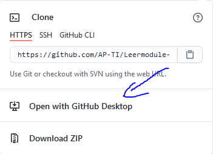

# Inleiding

Ik heb deze github eigenlijk opgestart om studenten te helpen bij het studeren. Nu is de vraag waarom?

Als je aan 2 programmeurs vraagt om een programma te ontwikkelen, en je legt de 2 programma's naast elkaar, dan gaan die nooit hetzelfde zijn. (Tenzij het natuurlijk een heel simpel programma is, maar je begrijpt wat ik bedoel). Daarom zorg ik er voor dat er meerdere oplossingen beschikbaar zijn voor jou. Echter om dit te bereiken heb ik de hulp nodig van medestudenten! Daarom doe ik een oproep aan jou om jouw oplossing te delen met mij zodat wij samen een community kunnen maken die studenten enorm kunnen helpen bij het studeren, want elke student pakt zijn oefening anders aan, en de een is wat creatiever dan de ander. Ik heb hiervoor een soort tutorial gemaakt die jou helpt hoe je nu meehelpt.

# Video tutorial
[Hoe voeg je je eigen wijzigingen toe aan een gezamelijk GitHub repo](https://youtu.be/J053hmKcFag)
# Geschreven tutorial
## Eerste stapjes

In deze uitleg ga ik jou de makkelijkste manier uitleggen.

Voor deze tutorial heb je 3 dingen nodig:

- [Visual studio code](https://code.visualstudio.com/)
- [Git](https://git-scm.com/downloads)
- [Github desktop](https://desktop.github.com/)

Download en installeer deze 3 programma's. (Ik veronderstel dat je de 1ste al gedownload hebt.)

Daarna is het belangrijk om op **GITHUB** een account aan te maken.
> Ik hoop dat je weet hoe je dit moet doen. Lukt dit niet stuur mij dan even een berichtje op Discord.

Als dit gelukt is. Moet je de Github desktop openen en inloggen met jouw account.

Daarna druk je op deze knop:

Vervolgens druk je op Open met Github Desktop:

Normaal krijg je een venster te zien met "koppeling openen".

Daarna zal Github desktop geopend worden en wordt het project lokaal gekloond.

Als je nu klikt op openen met Visual studio code kan je aanpassing toevoegen en die dan committen via een pull request. Ik kijk die dan na en als die goed is zal ik ze toevoegen.

> Ja mag natuurlijk ook altijd je oplossing naar mij doorsturen als dat gemakkelijker is, maar dit bespaart mij veel werk!

[Terug](/README.md)
